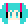

# Operation guide

## Toolbar menu

yoMMD provides a menu on toolbar with icon .  Menu items under the menu are:

 - Enable Mouse
 - Reset Position
 - Select Screen
 - Hide Window
 - Quit

Descriptions for each item are the following.

### Enable Mouse

Let yoMMD to capture mouse and keyboard inputs.
You can change model position, scale, etc while mouse and keyboards are enabled.
Use this menu item again to disable mouse and keyboard inputs.

### Reset Position

Reset model's position and scale to the initial state.

### Select Screen

Change screen where model is shown.  Only valid when there're multiple monitors.

### Hide Window

Hide the main window.  To show the main window again, please use this menu item again.

### Quit

Quit yoMMD.

## Mouse/trackpad gestures

Some mouse and trackpad operations are available when mouse is enabled.

### Mouse drag

Change model position.

### Mouse wheel scroll

Change model scale.  Reference point of scaling is the mouse position.

### Shift key + mouse wheel scroll

Rotate model.  Reference point of rotation is the mouse position.

### Right click

Show a menu that is same to the menu on toolbar.

### Pinch zoom gesture/smart zoom gesture on trackpad (macOS)

Change model scale.  Reference point of scaling is the mouse position.
